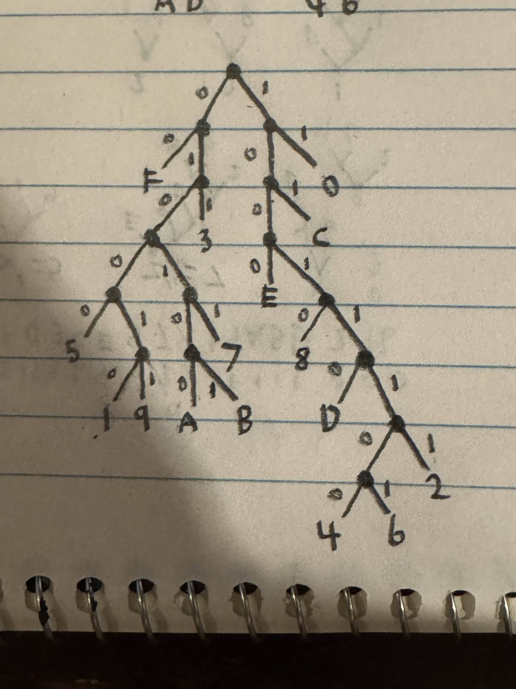

# Joshua Robles User Page
## Or something (this is a placeholder)

I don't have pictures of myself on this device so here's a Huffman tree [].

My name is Joshua Robles and software engineering is my **passion** but not really *though*. Here's something I said the other day:

>Something I said the other day funny greentext

Here's a program I wrote the other day:

`std::cout << "Hello, world!";`

~~It did not compile~~ and some more style text for you

Here's a link to my [pages repository (SECA)](https://github.com/j4robles/Github-Pages-project/tree/add-read-me).

The assignment said link(s) plural so here's a link to the [other branch of my pages repository (SNCA)](https://github.com/j4robles/Github-Pages-project/tree/main).

If you're too lazy to scroll up two inches, here's a [link to the header at the start](#joshua-robles-user-page).

Link(s) plural again so here's the [other header that's right below the first one](#or-something-this-is-a-placeholder).

Check out this cool [readme file](README.md).

Here's a link to that [sick Huffman tree you saw](assets/images/tree.jpg).

For the second picture, here's some graphs I recorded for something in physics a while ago. []

Programming languages I love:
- C++
- C#
- Python

Programming languages I hate:
- C++
- C#
- Python
- HTML

My top programming languages:
1. C++
2. C#
3. Power gap
4. Python
5. Human feces
6. Power gap
7. HTML

To-do for this page:
- [x] Fulfill all the assignment requirements
- [ ] Make it not garbage